# Capítulo V: Product Implementation, Validation & Deployment

## 5.1. Software Configuration Management

### 5.1.1. Software Development Environment Configuration

**Software Documentation and Project Management:**
- **Github:** Plataforma de control de versiones que facilitará la colaboración y revisión de cambios de cada miembro del equipo. Ruta de referencia: https://github.com/

**Requirements Management:**

- **Trello:** Herramienta utilizada para gestionar el flujo de trabajo de proyectos principalmente basados en marcos de trabajos ágiles. Será empleado para visualizar y actualizar el estado actual de las tareas e historias de usuario pertenecientes al sprint a desarrollar. Ruta de referencia: https://trello.com/es

**Product UX/UI Design:**

- **Figma:** Plataforma de elaboración de diseño de interfaces y elaboración de prototipos interactivos para las versiones de Landing Page, Desktop y Mobile Web Application. Ruta de referencia: https://www.figma.com/login

- **UX Pressia:** Diseño de User Personas, Empathy Maps, Journey Maps e Impact Mapping. Ruta de referencia: https://uxpressia.com/

- **Miro:** Empleado para el diseño de los As-Is y To-Be Scenario Maps. Ruta de referencia: 

- **Lucidchart:** Aplicación para diagramar flujos. Empleado para el diseño de Wireflows, User-Flows y el Diagrama de
  Clases asociado a la aplicación. Ruta de referencia: https://www.lucidchart.com/pages/es

- **Structurizr DSL:** Empleado para la creación de diagramas de software, utilizando el modelo C4. Ruta de referencia: https://structurizr.com/

**Software Development:**

- **Visual Studio Code:** Entorno de desarrollo integrado elegido para la elaboración de la Landing Page: https://code.visualstudio.com/
  
- **HTML:** Lenguaje de etiquetado para páginas web. Será empleado para el desarrollo de la presentación de la landing Page. Ruta de referencia: https://www.w3schools.com/html/html5_syntax.asp 
  
- **CSS:** Tecnología para dar estilo a las páginas web, permitiendo el diseño visual. Ruta de referencia: https://google.github.io/styleguide/htmlcssguide.html
  
- **JavaScript:** Lenguaje de programación orientado a objetos utilizado para implementar funcionalidades en la Landing Page. Ruta de referencia: https://developer.mozilla.org/es/docs/Web/JavaScript

**Software Deployment:**

- **Github Pages:** Plataforma que facilita el despliegue sencillo de páginas web directamente desde repositorios de GitHub. Ruta de referencia: https://pages.github.com/

### 5.1.2. Source Code Management

**Repositorio de Github:** https://github.com/GrupoLatex-SI0729-2510-4334/Final-Report

**Repositorio de Landing Page:** https://grupolatex-si0729-2510-4334.github.io/Landing-Page/

Para nuestra estrategia de gestión de versiones con Git, nos hemos inspirado en el artículo "A successful Git branching model" de Vincent Driessen, adoptando el modelo de ramificación GitFlow. Este enfoque nos permite establecer claramente las convenciones de ramificación que aplicaremos en nuestro proyecto.

**Flujo de trabajo GitFlow:**
 

**Estructura de Ramas (Branches):**

- **Main branch (Rama principal):** Rama base del proyecto donde se almacenan las versiones estables y listas para producción. Solo se integran cambios que hayan sido debidamente revisados y validados en otras ramas.

- **Develop branch (Rama de desarrollo):** Rama que sirve como espacio de trabajo colaborativo donde se integran las actualizaciones y cambios realizados por el equipo. Aquí se mantiene el código en constante evolución antes de ser lanzadas.

- **Release branches (Ramas de lanzamiento):** Se utilizan para facilitar la preparación de nuevas versiones del producto. Estas ramas parten de develop y permiten realizar ajustes finales. Las versiones se nombran siguiendo el esquema de versionado semántico (Semantic Versioning 2.0.0): release/vX.Y.Z.

- **Feature branches (Ramas de funcionalidad):** Se utiliza para desarollar nuevas funcionalidades o mejoras específicas en su propia rama independiente, separada de la rama principal de desarrollo. Una vez completada, se integrará a develop. Estas ramas seguirán una convención de nombres del tipo: feature/nombre-de-la-funcionalidad.

- **Hotfix branches (Ramas de corrección):** Creadas para resolver errores urgentes detectados que pueden afectar en la experiencia de usuario. Permiten la implementación de soluciones rápidas directamente sobre la rama principal. Se sigue la siguiente nomenclatura: hotfix/nombre-del-problema.

**Versionamiento Semántico:** 
 Para nombrar las Releases, se aplicará el sistema de versionamiento semántico (Semantic Versioning 2.0.0), donde:
- **X:** Versión principal, se incrementa cuando se realizan cambios significativos en la funcionalidad del software que podrían afectar su estructura.
- **Y:** Versión secundaria, se ajusta para la adición o eliminación de características sin modificar la estructura principal del software.
- **Z:** Versión de parche, se usa para pequeñas correcciones y mejoras que no afectan la funcionalidad principal.

**Convenciones de Commits:** 
 Para los mensajes de los commits realizados, se utilizará la especificación Conventional Commits basada en Angular Commit Guidelines. La estructura a seguir será la siguiente:
  `git commit -m "<type>[optional scope]:<title>" -m"<description">`

### 5.1.3. Source Code Style Guide & Coding Conventions
Para el correcto uso de lenguajes de programación, se adaptarán buenas prácticas respecto a las convenciones estándares para coding que garantizarán el correcto desarrollo de la solución.

**HTML:**

- A pesar que HTML permite mezclar letras mayúsculas y minúsculas en los nombres de los elementos, se recomienda usar nombres de elementos en minúsculas.
- Todos los elementos deben estar correctamente cerrados.
    `
This is a paragraph.
`
- Los nombres de etiquetas y atributos deben ir en minúscula.
    `href`
- Se recomienda entrecomillar los valores de los atributos.
    `<table class="striped">`

**CSS:**

- Los nombres de clases deben seguir la convención kebab-case. Ejemplo: `.ads-sample`
- Los selectores deben ser claros y específicos.
- Se debe mantener una estructura ordenada con propiedades agrupadas por tipo (layout, tipografía, colores, etc.).
- Se recomienda separar los selectores y declaraciones en líneas independientes.

**Gherkin:**

- Los escenarios deben escribirse en lenguaje natural estructurado: Given, When, Then.
- Los nombres de los escenarios deben ser claros, concisos y expresivos del comportamiento esperado.
- Se deben evitar detalles técnicos en las descripciones.
- La escritura debe orientarse a la colaboración entre roles técnicos y no técnicos.

**Angular:**

- Convenciones de estructura de archivos `hero.component.ts|html|css|spec`
- Aplicar el método Principio de responsabilidad única (SRP)a todos los componentes, servicios y otros símbolos, garantiza que la aplicación sea más limpia, más fácil de leer y mantener, y más comprobable.
- Se deben separar los nombres de archivos con puntos y guiones.
- La nomenclatura de servicios debe estar acopmañado del sufijo: `.service.ts`

**Java:**

- Nombres de clases en PascalCase `UserService`.
- Métodos y atributos en camelCase `getUserData()`.
- Uso de anotaciones como `@RestController`, `@Service`, `@Repository` para definir roles.
- Estructura clara del proyecto basada en paquetes por capas.
  
**JavaScript:**

- Los nombres de clases deben escribirse usando camelCase. Suelen ser sustantivos o frases nominales. Ejemplo: `Character`
- Los nombres de funciones y variables deben seguir lowerCamelCase. Suelen ser verbos o frases verbales. Ejemplo: `sendMessage`
- Cada declaración de variable (de campo o local) declara solo una variable. Ejemplo: `int a`

**TypeScript:**

- Los literales de cadena ordinarios se delimitan con comillas simples ('').
- Organización del código en módulos y componentes reutilizables.
- Los nombres de clases deben seguir PascalCase y los métodos camelCase.
- Se pueden crear instancias de errores mediante `throw new Error('')`.

**Spring Boot:**

- Definición de componentes siguiendo los principios de Spring: `@RestController`, `@Service`, `@Repository`, `@Entity`.
- Aplicar la convención de configuración mínima: principios de "convention over configuration".
- Organización de proyectos en módulos claramente separados (API, Services, Repository, Config).

### 5.2. Landing Page, Services & Applications Implementation
#### 5.2.1. Sprint 1
##### 5.2.1.1. Sprint Planning 1

| **Sprint #**                      | **Sprint 1**                                                                 |
|----------------------------------|------------------------------------------------------------------------------|
| **Sprint Planning Background**   |                                                                              |
| **Date**                         | 19/04/2025                                                                   |
| **Time**                         | 09:00 PM                                                                     |
| **Location**                     | Servidor de Discord del Equipo                                               |
| **Prepared By**                  | Diego Cabrera                                                             |
| **Attendees (to planning meeting)** | Diego Cabrera / Andrea Santur / Alessandra Becerra / Joaquin Pedraza / Pedro Nanfuñay |
| **Sprint 1 Review Summary**      |   En este sprint, el equipo se enfocó en establecer la base del proyecto: se creó, diseñó y lanzó la primera versión operativa de la landing page, incorporando elementos esenciales como la descripción del servicio, los planes de suscripción, formularios de contacto y soporte multilenguaje. Además, se realizaron tareas de UX, como la elaboración de User Personas, Journey Maps y la definición de la arquitectura de información.     |
| **Sprint 1 Retrospective Summary** |      Los miembros del equipo señalaron que la colaboración y el trabajo en conjunto fueron efectivos. Resaltaron logros en la integración de herramientas como UXPressia, Figma y en el diseño responsivo. Como oportunidad de mejora, se propuso optimizar la gestión del tiempo en las subtareas y definir criterios de aceptación más claros desde el comienzo.   |
| **Sprint Goal & User Stories**   |        Finalizar la etapa de descubrimiento e investigación, validación de usuarios, análisis de la competencia, diseño de la arquitectura de la información y la estructura básica de la landing.      |
| **Sprint 1 Goal**                |   El objetivo fue crear una landing page completa y alineada con la visión del proyecto “TocaAquí”, garantizando que fuera funcional, responsiva, accesible y visualmente atractiva para artistas y locales. Además, este sprint estableció las bases para la experiencia de usuario, con entregables como User Personas, Empathy Maps, Wireframes y Style Guides.       |
| **Sprint 1 Velocity**            | 4 Velocity                                                                   |
| **Sum of Story Points**          | 6 Story Points                                                               |

##### 5.2.1.2. Aspect Leaders and Collaborators

| Team Member              | GitHub Username     | Landing Page | Diseño UI/UX | HTML/CSS | TypeScript | Documentación |
|--------------------------|---------------------|--------------|---------------|----------|-------------|----------------|
| Andrea Santur           | andreli-star        | C            | C             | C        | L           | C              |
| Diego Cabrera           | OscarAntayhuaCastillo | L            | C             | C        | C           | L              |
| Alessandra Becerra           | aleeBecerra        | C            | C             | L        | C           | C              |
| Joaquin Pedraza            | JoaquinPedraza1             | C            | C             | C        | L           | C              |
| Pedro Nanfuñay          | PedroJ18        | C            | L             | C        | C           | C              |

##### 5.2.1.3. Sprint Backlog 1

| **User Story Id** | **User Story Title** | **Work-Item/Task Id** | **Work-Item/Task Title** | **Description** | **Estimation** | **Assigned To** | **Status** |
|:-----------------:|:--------------------:|:---------------------:|:-----------------------:|:---------------:|:--------------:|:--------------:|:----------:|
| US01 | Visualización clara del propósito de la plataforma	 | T01 | Diseño general de la landing page | Creación y redacción del propósito de nuestra plataforma | 5h | Diego Cabrera | Done |
| US02 | Visualización de planes para artistas y locales | T02 | Visualización de las subscripciones | Creación de los planes de pago de TocaAquí | 3h | Andrea Santur | Done |
| US03 | Visualización del equipo de desarrollo en la landing | T03 | Redacción de la sección de "Sobre Nosotros" | Creación de la sección de presentación del equipo | 2h | Joaquin Pedraza | Done |
| US04 | 	Acceso rápido a registro desde botones CTA | T04 | Presentación del formulario | Creación del formulario a ser rellenado por el artista o por el promotor | 3h | Alessandra Becerra | Done |

#### 5.2.1.4. Development Evidence for Sprint Review

| Repository   | Branch | Commit Id | Commit Message   | Commit Message Body (resumen) | Committed on  |
|-|-|-|-|-|-|
| Landing-Page  | main   | 237e8ed  | feat(index): fixed the name of the author. | Actualización de los nombres del autor | Apr 24, 2025 |
| Landing-Page  | main   | f49a655  | feat(team): fixed some descriptions of the team section.  | Actualización de la descripción del equipo | Apr 23, 2025  |
| Landing-Page  | main   | 7f7345c  | feat(landing) :added the profile picture. | Adición de las imágenes de los integrantes | Apr 23, 2025 |
| Landing-Page  | main   | 3356279  | feat(team): fixed the name of the photo. | Acrualización de los nombres de las fotos de peril | Apr 22, 2025 |
| Landing-Page  | main   | d6e0832  | feat(landing-page) add Andrea's profile. | Actualización del perfil del integrante | Apr 22, 2025 |
| Landing-Page  | main   | 873345f  | feat(landing-page): add Alessandra's profile. | Actualización del perfil del integrante | Apr 22, 2025 |
| Landing-Page  | main   | ea70218  | feat(landing-page): add Pedro Nanfuñay's profile. | Actualización del perfil del integrante | Apr 22, 2025 |
| Landing-Page  | main   | a14593e  | feat(landing-page) adedd image Joaquin Pedraza. | Actualización del perfil del integrante | Apr 22, 2025 |
| Landing-Page  | main   | 23146dc  | feat(hamburguer-menu): fxed the visual section of the hamburguer menu. | Actualización de la funcionalidad del menú hamburguesa | Apr 22, 2025 |
| Landing-Page  | main   | b54d783  | feat(landing) Update styles css. | Actualización de los estilos de la landing page | Apr 20, 2025 |
| Landing-Page  | main   | 9b54208  | feat(landing-page): added the general content of the landing page. | Adición de los archivos y el código de la landing page en general | Apr 19, 2025 |

#### 5.2.1.5. Execution Evidence for Sprint Review
En este primer Sprint, hemos creado la Landing Page del proyecto "TocaAquí". Gracias a esta, los usuarios pueden conocer de manera clara la propuesta de nuestra plataforma, que busca conectar a músicos independientes con locales de eventos, facilitando la contratación, coordinación y pagos seguros.

A continuación, se presentan las User Stories correspondientes que fueron realizadas y reflejan el trabajo realizado:

| **ID** | **User Story** | **Evidencia en Landing Page** |
|:------:|:--------------:|:-----------------------------:|
| US01 | Visualización clara del propósito de la plataforma	 |  Diseño general de la landing page |
| US02 | Visualización de planes para artistas y locales |  Visualización de las subscripciones |
| US03 | Visualización del equipo de desarrollo en la landing |  Redacción de la sección de "Sobre Nosotros" |
| US04 | Acceso rápido a registro desde botones CTA | Presentación del formulario |

**Propósito de la Plataforma**
El diseño general de la landing page transmite de manera clara y directa el propósito de TocaAquí, permitiendo al visitante entender rápidamente la misión de la plataforma y lo que ofrece.

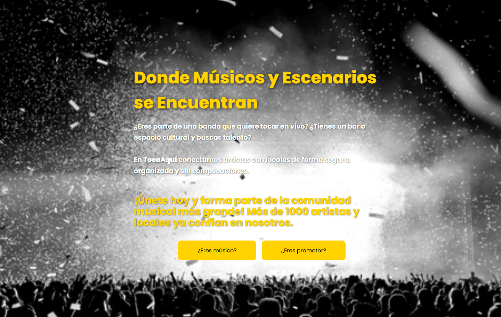

**Planes Disponibles**
Se visualizan claramente las suscripciones disponibles para artistas y locales, con una estructura fácil de entender y botones de acción visibles para facilitar la interacción de los usuarios.

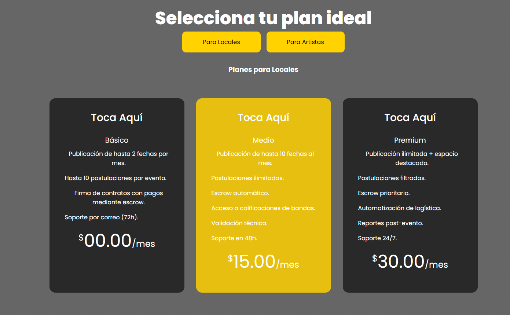

**Nuestro Equipo**
La sección "Sobre Nosotros" presenta al equipo de desarrollo de TocaAquí, mostrando perfiles y contribuyendo a la transparencia del proyecto, lo que fortalece la confianza en la plataforma.

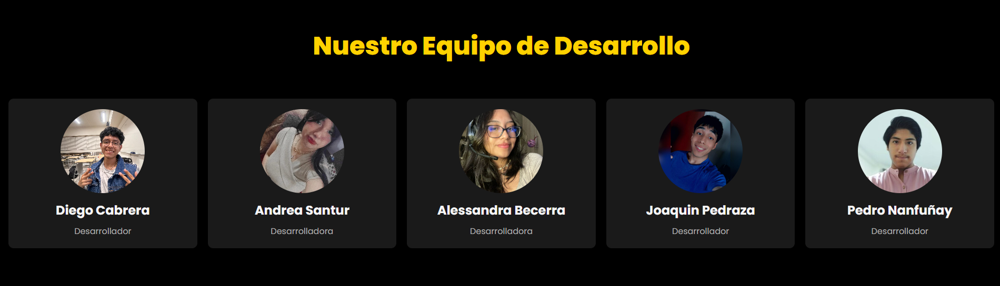

**Acceso Rápido al Registro**
Los botones de llamada a la acción (CTA) en la landing page permiten un acceso rápido y fácil al formulario de registro, asegurando que los usuarios puedan unirse a la plataforma sin complicaciones.

#### 5.2.1.6. Services Documentation Evidence for Sprint Review

Durante el Sprint 1 no se trabajaron endpoints documentados, ya que el alcance se centró solamente en el desarrollo del Landing Page y de la documentación del proyecto. La documentación OpenAPI comenzará en el Sprint 2.

#### 5.2.1.7. Software Deployment Evidence for Sprint Review

Durante el Sprint 1, se realizó el despliegue de la landing page del proyecto utilizando **GitHub Pages**.

- **Repositorio:** [Landing Page](https://github.com/GrupoLatex-SI0729-2510-4334/Landing-Page)
- **URL de producción:** [https://1asi0730-2510-4370-g1-tocaaqui.github.io/Landing-Page/](https://grupolatex-si0729-2510-4334.github.io/Landing-Page/)
- **Branch desplegado:** `main`

El sitio fue configurado y publicado correctamente, permitiendo acceso público a las secciones: Inicio, Sobre Nosotros, Planes y Contactanos.

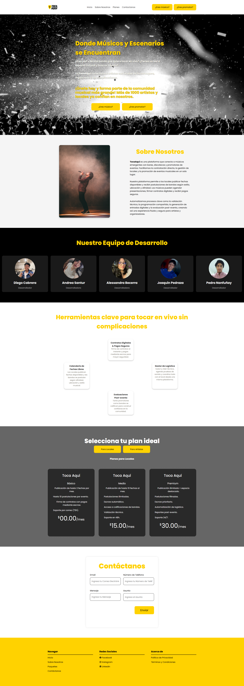

#### 5.2.1.8. Team Collaboration Insights during Sprint

En la realización del Sprint 1, se observó una participación activa y equitativa entre los miembros del equipo, lo que se reflejó tanto en la frecuencia de los commits como en las funcionalidades aportadas. En total, se realizaron 170 commits, provenientes de 5 autores diferentes, destacándose la colaboración en ramas específicas como feat/chapter1, feat/chapter2, feat/chapter3, feat/chapter4, feat/chapter5 y develop, todas integradas correctamente a través de pull requests.

| Integrante | Commits | Líneas añadidas | Líneas eliminadas | Áreas de contribución principales  |
|-|-|-|-|-|
| andreli-star | 75  | 674   | 363  | chapter3, chapter4, chapter5 |
| aleeBecerra | 46 | 356  | 65  | chapter1, chapter2, chapter4, chapter5 |
| omele7 | 21  | 853 | 111 | all chapters |
| PedroJ18 | 15 | 251  | 4  | chapter1, chapter2, chapter4, chapter5 |
| JoaquinPedraza1 | 13  | 133  | 11   | all chapters  |

**Commits:**
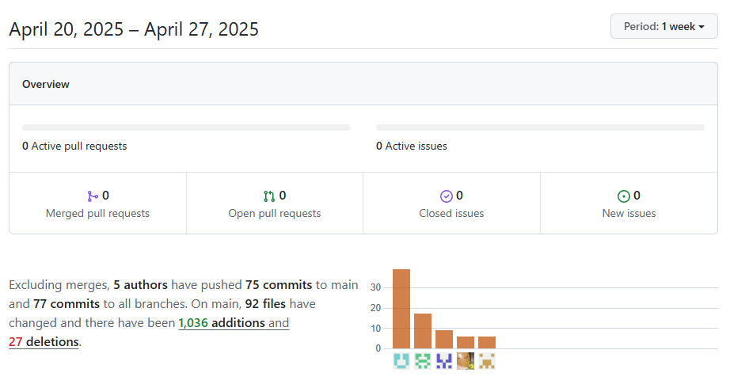

**Analiticas de Colaboración:**  
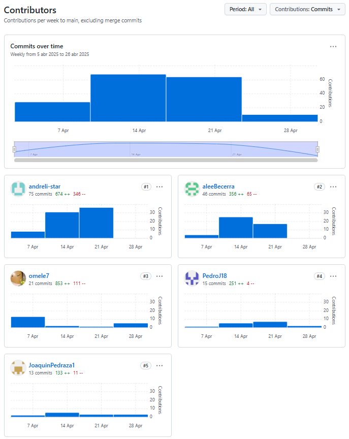

## 5.2.2 Sprint 2
### 5.2.2.1 Sprint planning 2 
| Sprint # | Sprint 2  | 
|--------------------|------------|
| Sprint Planning Background | 
| Date | 2025-05-16 | 
| Time |  13:00 PM |
| Location |  UPC - Campus San Miguel |
| Preparate by| Joaquin Pedraza Maldonado | 
|  Attendees (to planning meeting) | Diego Ivan Cabrera ,Alessandra Becerra, Andrea Santur, Pedro Jesús Liza Nafuñay y Pedraza Maldonado Joaquin Andree ,  | 
| Sprint n-2 Review Summary | --- | 
| Sprint Planning Background | Durante esta etapa, se llevó a cabo una exhaustiva verificación del frontEnd y la implementacion de las mejoras continuas dadas en nuestro sprint 1. |
| Sprint Goal & User Stories | 
| Sprint 2 Goal | Desarrolar la funcionalidad de la  webb App con i18n. Se considerará que el objetivo del sprint se ha cumplido con la funcionalidad hecha y el frontEnd.|  
| Sprint Velocity | Se establece un Velocity de 20 Story Points para este Sprint. | 
| Sum of Story Points | 18 Story Points | 

### 5.2.2.2 Aspect Leaders and Collaborators.

| Team Member              | GitHub Username     | FrontEnd | Angular Material | HTML/CSS | TypeScript | Documentation |
|--------------------------|---------------------|--------------|---------------|----------|-------------|----------------|
| Andrea Santur           | andreli-star        | C            | C             | C        | L           | C              |
| Diego Cabrera           | OscarAntayhuaCastillo | L            | C             | C        | C           | L              |
| Alessandra Becerra           | aleeBecerra        | C            | C             | L        | C           | C              |
| Joaquin Pedraza            | JoaquinPedraza1             | C            | C             | C        | L           | C              |
| Pedro Nanfuñay          | PedroJ18        | C            | L             | C        | C           | C              |

#### 5.2.2.3 Sprint Backlog 2

| **User Story Id** | **User Story Title** | **Work-Item/Task Id** | **Work-Item/Task Title** | **Description** | **Estimation** | **Assigned To** | **Status** |
|:-----------------:|:--------------------:|:---------------------:|:-----------------------:|:---------------:|:--------------:|:--------------:|:----------:|
| US012 | Acceso al dashboard del local	 | T01 | Acceso a la vista de todos los eventos | Creación y redacción del propósito de nuestra plataforma | 5h | Diego Cabrera | Done |
| US015 | Búsqueda de eventos compatibles con mi perfil | T02 | Visualización de filtros de búsqueda | Creación de la búsqueda de los eventos de TocaAquí | 3h | Alessandra Becerra | Done |
| US016 | Postulación rápida a un evento desde la plataforma | T03 | Redacción de la postulación a eventos | Creación de la sección de postulación de los músicos | 2h | Joaquin Pedraza | Done |
| US018 | 	Gestión y edición de mi perfil artístico | T04 | Presentación del perfil de usuario | Creación del formulario a ser editado por el usuario | 3h | Pero Nanfuñay | Done |

### 5.2.2.4 Development Evidence for Sprint Review

Durante este sprint, se han realizado avances significativos en la implementación de la Landing Page. Se han completado varias historias de usuario de la landing page y se han realizado múltiples commits en los repositorios correspondientes. A continuación, se presenta una tabla que incluye los commits relacionados con la implementación para el repositorio de la landing page.

| Repository   | Branch | Commit Id | Commit Message   | Commit Message Body (resumen) | Committed on  |
|-|-|-|-|-|-|
| front-end  | master   | 5b6460e  | feat(front-end): added the final changes. | Actualización de los cambios finales | May 16, 2025 |
| front-end  | develop   | ac055a3  | feat(develop):added modificed agenda.  | Actualización del componente de Agenda | May 16, 2025  |
| front-end  | develop   | 77e55ac  | feat(json-server): fixed some issue. | Correción del JSON server | May 16, 2025 |
| front-end  | develop   | aadf479  | feat(develop) adedd dependecies | Acrualización de las dependencias | May 15, 2025 |
| front-end  | develop   | 70084fe  | feat(develop): added events data | Actualización de los eventos | May 15, 2025 |
| front-end  | develop   | 8312040  | feat(frontend): added all the components of the web application. | Actualización de los componentes de la aplicación. | May 12, 2025 |

### 5.2.2.5 Execution Evidence for Sprint Review

Durante este Sprint, se han alcanzado varios hitos importantes en la implementación de la Web Application. Se han completado las siguientes tareas:

Dashboard de eventos

 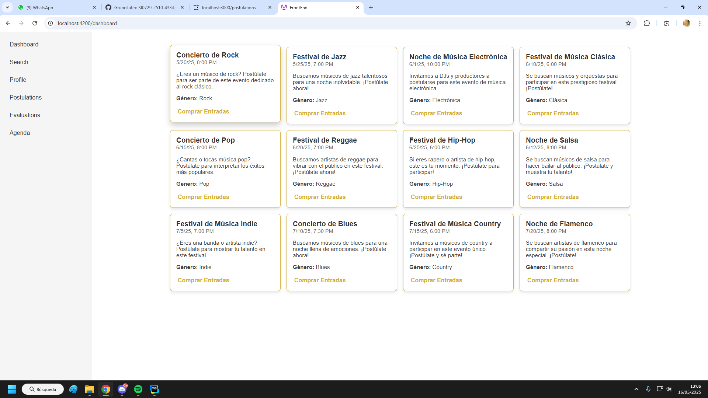 
Busqueda de eventos
 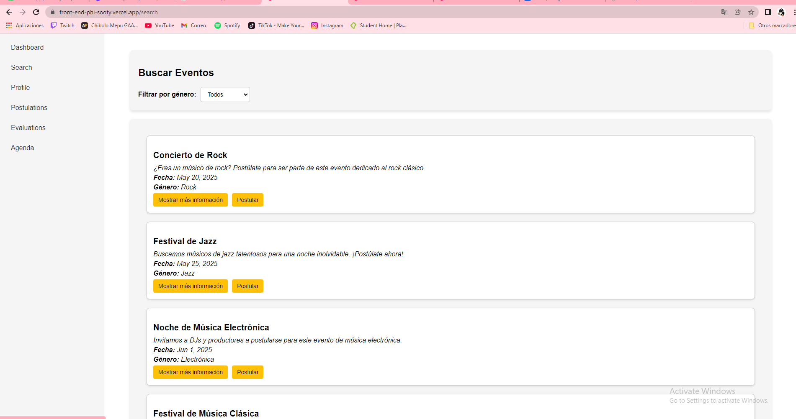 
Perfil de usuario 
 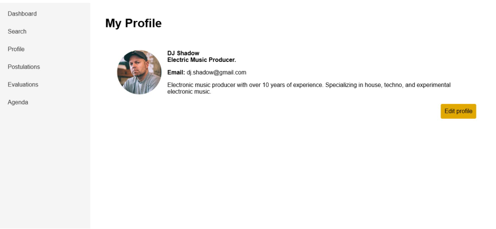 
Editar Perfil
 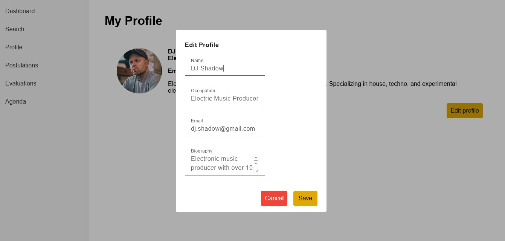 
Ver los eventos para postular
 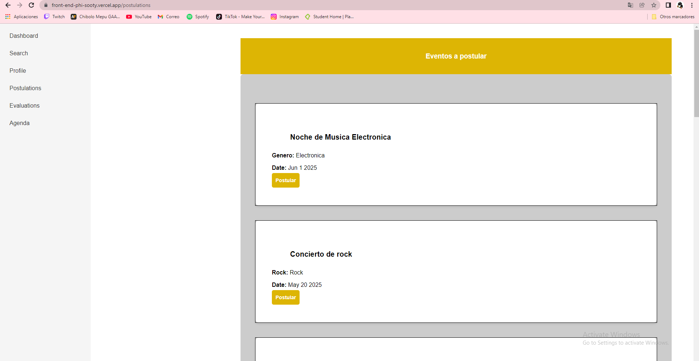 
Postular y registrarse a un evento 
 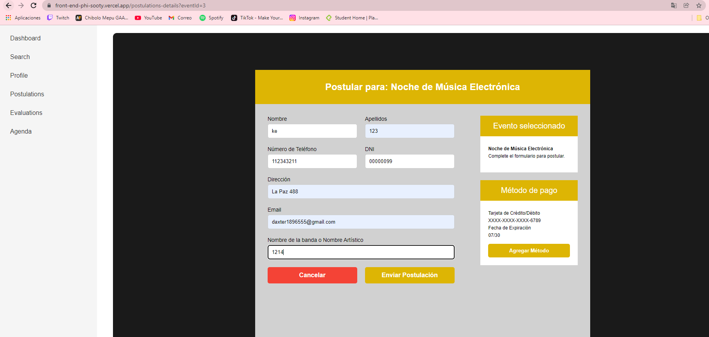 
Evaluar eventos musicales
 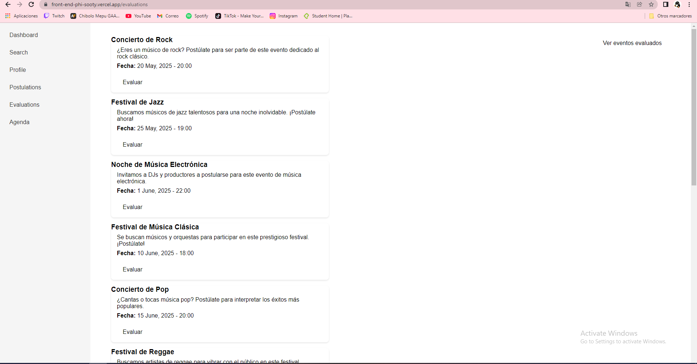 
Editar evaluación de evento 
 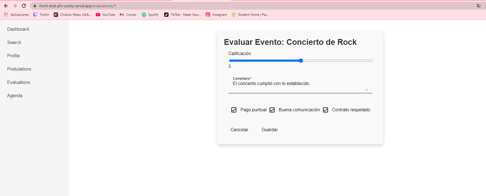 
Ver mi agenda de eventos
 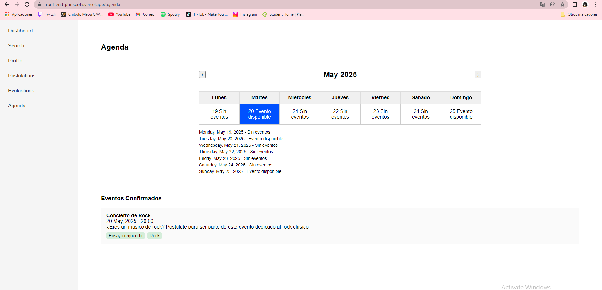 

#### 5.2.2.6 Services Documentation Evidence for Sprint Review 2

Para el desarrollo de la plataforma, específicamente en la parte del Frontend, utilizamos lo siguiente:

Webstorm (IDE de desarrollo): Usamos Webstorm como nuestro entorno de desarrollo integrado para trabajar en el Frontend.

Angular : Optamos por Angular como el  principal para el desarrollo.

GitHub: Nuestro repositorio del Frontend está alojado en GitHub, lo que facilita la colaboración y el seguimiento de los cambios en el código.

### 5.2.2.7 Software  Deployment Evidence for Sprint Review 
 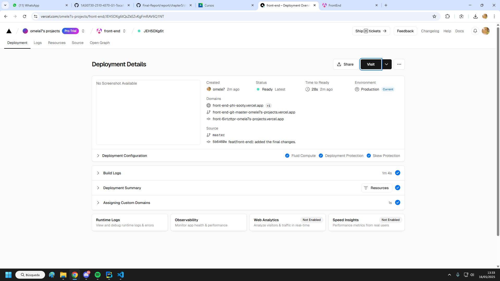 

Landing Page: [https://grupolatex-si0729-2510-4334.github.io/Landing-Page/](https://grupolatex-si0729-2510-4334.github.io/Landing-Page/)

Frontend: [https://front-end-phi-sooty.vercel.app/](https://front-end-phi-sooty.vercel.app/)

## 5.2.2.8 Team Collaboration Insights during Sprint
Durante este Sprint, el equipo ha trabajado de manera colaborativa en el diseño y programacion en la implementación de la Web Application de Grupo Latex. A continuación, se presenta un resumen de cómo se han desarrollado las actividades de implementación, junto con capturas de pantalla de los analíticos de colaboración y commits en GitHub realizados por los miembros del equipo.

 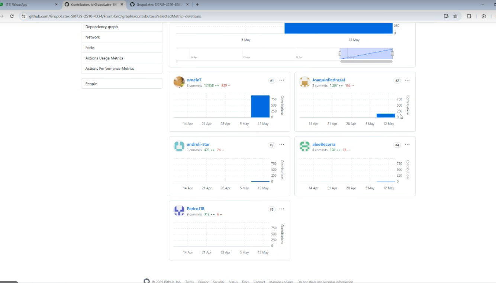 
 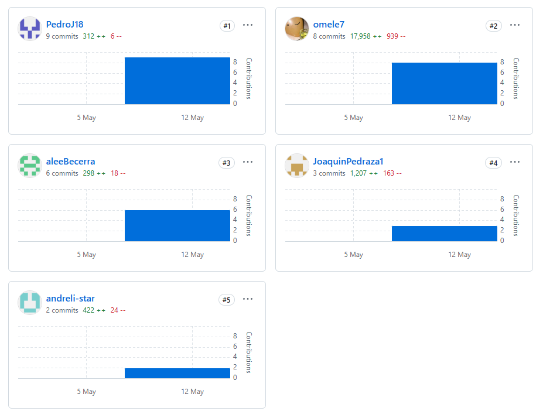 

### 5.2.3. Sprint 3
#### 5.2.3.1. Sprint Planning 3
| **Sprint #**                    | Sprint 3                                                                                                                                                                                                                                                                                                                                                                              |
|---------------------------------|---------------------------------------------------------------------------------------------------------------------------------------------------------------------------------------------------------------------------------------------------------------------------------------------------------------------------------------------------------------------------------------|
| **Sprint Planning Date**        |        20/06/25                                                                                                                                                                                                                                                                                                                                                         |
| **Time**                        | 0:12 AM                                                                                                                                                                                                                                                                                                                                                                            |
| **Location**                    | Google Meet                                                                                                                                                                                                                                                                                                                                                                           |
| **Prepared By**                 | Joaquin Pedraza                                                                                                                                                                                                                                                                                                                                                                    |
| **Attendees**                   | Diego Cabrera,Pedro Nanfuñay ,Andrea Santur, Joaquin Pedraza                                                                                                                                                                                                                                                                                                                     |
| **Sprint Review Summary**       | Se desplego el front end de y se empezo a desarrollar el backend.                                                                                                                                                                                                                                                                                                            |
| **Sprint Retrospective Summary**| Se desplego el front  end de manera efectivo y se desarrollo el back-end de TocaAqui.Asimismo se aplico las mejoras continuas dadas en el anterior Sprint 2                                                                                                                                                                                                                                                        |
| **Sprint Goal**                 | En este sprint, el objetivo es desarrollar la lógica y funcionalidades principales del backend de la aplicación web, además de su despliegue. Durante las diversas reuniones del equipo, se asignaron tareas específicas a cada integrante para implementar los servicios del backend. |
| **Sprint Velocity**             | 30                                                                                                                                                                                                                                                                                                                                                                                    |
| **Sum of Story Points**         | 30 Story Points                                                                                                                                                                                                                                                                                                                                                                       |
### 5.2.3.2 Aspect Leaders and Collaborators.
| Team Member              | GitHub Username     | BackEnd | Springboot | HTML/CSS | TypeScript | Documentation |
|--------------------------|---------------------|--------------|---------------|----------|-------------|----------------|
| Andrea Santur           | andreli-star        | L           | C             | C        | L           | C              |
| Diego Cabrera           | Omele7 |C            | C             | C        | L          | L              |C
| Alessandra Becerra           | aleeBecerra        | C            | L             | L        | C           | C              |
| Joaquin Pedraza            | JoaquinPedraza1             | L            | C             | C        | L           | C              |
| Pedro Nanfuñay          | PedroJ18        | C            |   C           | L        | C           | L              |

#### 5.2.3.3. Sprint Backlog 3

| **User Story Id** | **User Story Title** | **Work-Item/Task Id** | **Work-Item/Task Title** | **Description** | **Estimation** | **Assigned To** | **Status** |
|:-----------------:|:--------------------:|:---------------------:|:-----------------------:|:---------------:|:--------------:|:--------------:|:----------:|
| US009 | Selección del tipo de usuario desde la landing | T01 | Selección de tipo de usuarios en la Landing Page | Seleccionar el tipo de usuario a registrar que redirige a la Web Application | 2h | Diego Cabrera | Done |
| US010 | Registro como artista en la plataforma | T02 | Registro de usuario como artista | Registro de usuario como artista en la página de login | 3h | Diego Cabrera | Done |
| US011 | Registro como administrador de local | T03 | Registro de usuario como promotor | Registro de usuario como promotor en la página de login | 3h | Diego Cabrera | Done |
| US024 | Registro de la evaluación del evento | T04 | Registro de comentarios respecto al evento | Registro de comentarios respecto al desempeño del evento finalizado | 4h | Diego Cabrera | Done |
| US025 | Visualización las evaluaciones del evento | T05 | Visualización de evaluaciones realizadas al evento | Visualización de las evaluaciones y comentarios registrados tras la finalización de un evento | 2h | Diego Cabrera | Done |
| US026 | Añadir elementos al portafolio | T06 | Registro de elementos al portafolio del usuario | Creación y registro de elementos para el portafolio del usuario | 4h | Pedro Nanfuñay | Done |
| US027 | Visualización de elementos del portafolio | T07 | Visualización de elementos registrados en el portafolio | Visualización de elementos añadidos al portafolio por el usuario | 3h | Pedro Nanfuñay | Done |
| US028 | Filtro de eventos por criterios | T08 | Filtrado de búsqueda de eventos por criterios | Filtros de búsqueda de eventos por criterios | 3h | Andrea Santur | Done |
| US029 | Restablecer filtros aplicados | T09 | Restablecer filtros de búsqueda de eventos aplicados | Restablecer filtros de búsqueda aplicados a los eventos disponibles | 2h | Alessandra Becerra | Done |
| TS001 | Registro de usuario (artista o promotor) a través de un RESTful API | T10 | Registro de usuarios en el web services | Registro de usuarios a través del Web Services | 3h | Pedro Nanfuñay | Done |
| TS003 | Publicar evento desde un RESTful API | T11 | Registro de un evento en el web services | Publicación de eventos a través del Web Services | 3h | Diego Cabrera | Done |
| TS011 | Visualización de postulaciones del artista vía RESTful API | T12 | Visualización de postulaciones registradas | Visualización de postulaciones registradas por el músico a través del Web Services | 2h | Joaquin Pedraza | Done |
| TS012 | Evaluación post-evento mediante RESTful API | T13 | Registro de evaluación de evento | Registro de evaluación tras la finalización del evento a través del Web Services | 2h | Diego Cabrera | Done |
| TS013 | Carga y edición del perfil artístico vía RESTful API | T14 | Editar información del perfil | Editar información del perfil a través del Web Services | 2h | Pedro Nanfuñay | Done |

#### 5.2.3.4. Development Evidence for Sprint Review 3

Durante el presente sprint, se han realizado avances e implementaciones significativas en el desarrollo del Backend, así como en la segunda versión del Frontend. Se han completado historias relacionadas a los mismos mediante múltiples commits en los repositorios correspondientes. A continuación, se presenta una tabla que incluye los commits relacionados con la implementación para los repositorios del Frontend y Backend.

| **Repository**     | **Branch** | **Commit Id** | **Commit Message** | **Commit Message Body (resumen)** | **Committed on (Date)** |
|--------------------|------------|---------------|---------------------|----------------------------------|--------------------------|
| Front-End | master | 1b9f513 | feat: updated profile section | Actualización de la sección de Perfil | Jun 13, 2025 |
| Front-End | master | 1c79b36 | feat: added add portfolio item dialog component | Añadir un elemento al portafolio | Jun 13, 2025 |
| Front-End | master | af77eaf | feat: added portfolio list component | Obtener la lista de elementos del portafolio | Jun 13, 2025 |
| Front-End | master | 336538c | feat: added portfolio item component | Obtener elemento del portafolio | Jun 13, 2025 |
| Front-End | master | fbe3ccf | feat: added profile reviews section | Sección Reviews añadida en Perfil | Jun 13, 2025 |
| Front-End | master | 9c0d7a1 | feat: updated profile api service | Actualización del servicio de Perfil | Jun 13, 2025 |
| Front-End | master | be5b74c | feat: updated profile entity | Actualización de la entidad Profile | Jun 13, 2025 |
| Front-End | master | 1ceb399 | feat: added portfolio entity | Entidad Portafolio añadida | Jun 13, 2025 |
| Front-End | master | b90bb3f | feat:added updated section agenda | Actualización de la sección de Agenda | Jun 13, 2025 |
| Front-End | master | e9ba6c8 | feat(master) Adedd Saved-postulations | Función para guardar postulaciones | Jun 13, 2025 |
| Front-End | master | edbb82a | feat: fixed the evaluation assembler section. | Corregido servicio assembler de la sección Evaluaciones | Jun 13, 2025 |
| Front-End | master | 0140ded | feat: fixed the serverBaseUrl path. | Url base corregida | Jun 13, 2025 |
| Back-End | main | 1c75ced | feat: added the deploy version. | Versión del proyecto listo para el deploy | Jun 20, 2025 |
| Back-End | main | 80f5d24 | feat(develop):backend agenda api | Se añadió el API service para Agenda | Jun 19, 2025 |
| Back-End | main | 8481dba | feat: added search | Se añadió el API service para Búsqueda de eventos  | Jun 19, 2025 |
| Back-End | main | 34ef64f | feat: added portfolio entity and resource. | Se añadió la entidad y recurso de Portafolio | Jun 18, 2025 |
| Back-End | main | 27813f2 | feat: added profile API service. | Se añadió el API service para Perfil | Jun 18, 2025 |
| Back-End | main | ed8b7d5 | feat: fixed the postulation service and the evaluation service. | Corregido el API service de Postulaciones y Evaluaciones | Jun 18, 2025 |
| Back-End | main | af588f5 | feat(develop) Update PostulationQueryService | Actualización del Query Service de Postulación | Jun 17, 2025 |
| Back-End | main | ee5f89a | Feat(develop) Update Postulations | Actualización del API service de Postulaciones | Jun 17, 2025 |
| Back-End | main | 971e5a8 | feat: added the evaluation API service. | Se añadió el API service de Evaluaciones | Jun 17, 2025 |
| Back-End | main | bad00f0 | feat: fixed some issues of the documentation setion. | Corregido algunos errores en la estructura del proyecto | Jun 17, 2025 |
| Back-End | main | dcbad31 | feat: created the base of the API service. | Creado el API service base | Jun 17, 2025 |
| Back-End | develop | cbbad3b | feat(develop) Adedd Bounded Postulations | Se añadió el Bounded Context de Postulaciones | Jun 16, 2025 |
| Back-End | develop | bc24982 | feat: added the tocaaqui backend section. | Creación de la estructura base del proyecto Backend para TocaAquí | Jun 12, 2025 |

#### 5.2.3.4. Testing Suite Evidence for Sprint Review 3
En este sprint, se ha completado el desarrollo de la landing page. Para su despliegue, se emplearon varias herramientas clave, entre ellas:

#### 5.2.3.5. Execution Evidence for Sprint Review 3

Durante el presente sprint, se desarrollaron las principales technical stories para la realización de los servicios web.

Postulation
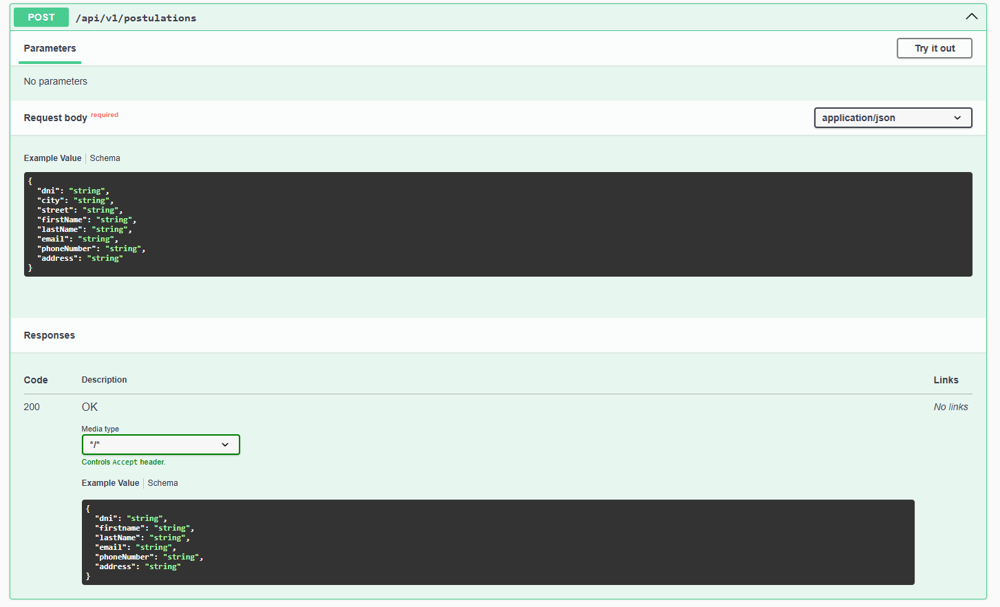

Agenda
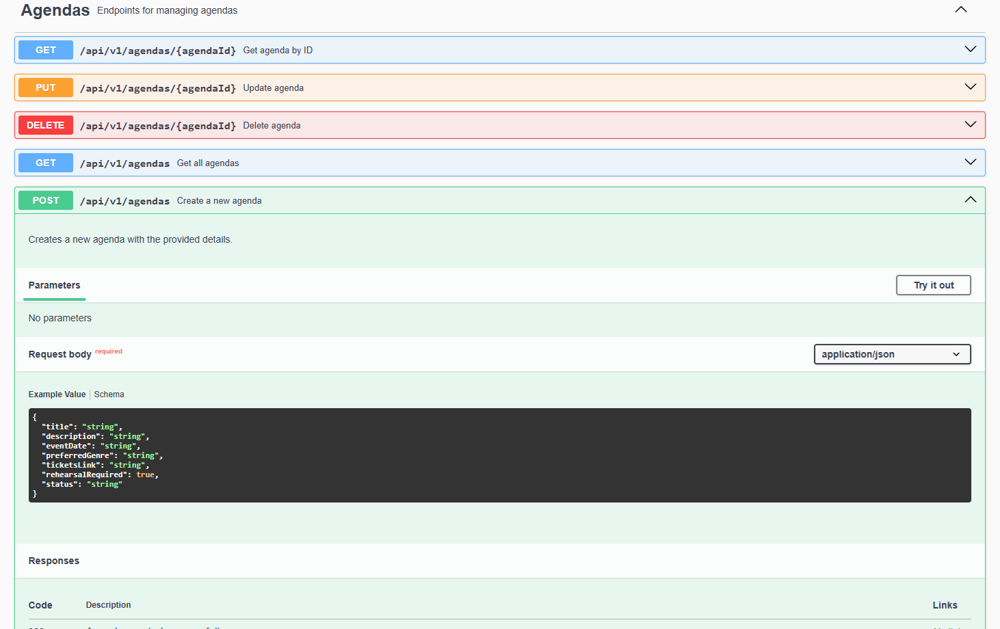

Profile
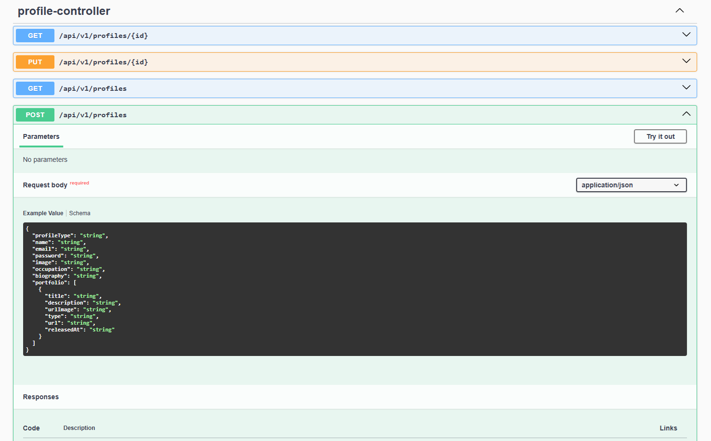

Evaluation
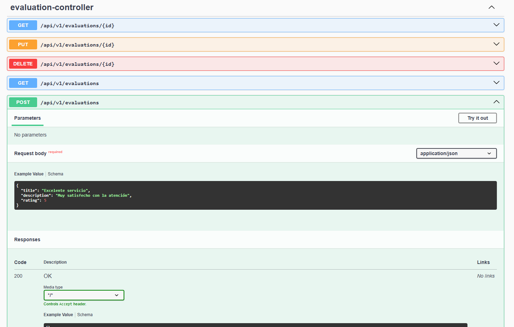

Search
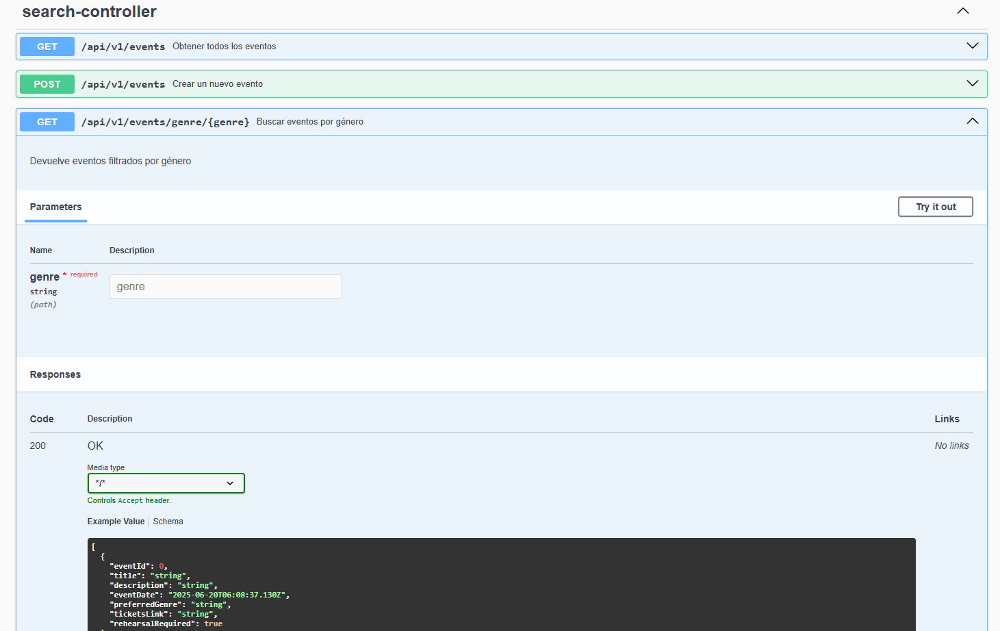

#### 5.2.3.6. Services Documentation Evidence for Sprint Review 3
Durante este sprint se desarrollaron los siguientes endpoints, organizados por controlador, que permiten gestionar perfiles, agendas, postulaciones, evaluaciones y eventos.

| **Endpoint Name**       | **Implemented Actions** | **Call Syntax**                                   | **Parameters Specification**                                     | **Call Example**                                                   | **Response Explanation**                                   |
|-------------------------|--------------------------|---------------------------------------------------|------------------------------------------------------------------|--------------------------------------------------------------------|-------------------------------------------------------------|
| `/postulations`         | POST                     | `return http.post(this.resourceEndpoint, body)`   | `candidateId`, `eventId`, `motivation`                           | `http.post('http://localhost:8080/api/v1/postulations', body)`    | Crea una nueva postulación.                                |
| `/agendas`              | GET, POST, PUT, DELETE   | `return http.get(this.resourceEndpoint)`          | `agendaId`, `title`, `description`, `date`, `location`          | `http.get('http://localhost:8080/api/v1/agendas')`                | Devuelve un array con todas las agendas.                   |
| `/agendas/{agendaId}`   | GET, PUT, DELETE         | `return http.get(this.resourceEndpoint + id)`     | `agendaId`                                                       | `http.get('http://localhost:8080/api/v1/agendas/1')`              | Devuelve la agenda correspondiente al ID.                  |
| `/profiles`             | GET, POST, PUT           | `return http.get(this.resourceEndpoint)`          | `id`, `name`, `email`, `bio`, `interests`                        | `http.get('http://localhost:8080/api/v1/profiles')`               | Devuelve todos los perfiles registrados.                   |
| `/profiles/{id}`        | GET, PUT                 | `return http.get(this.resourceEndpoint + id)`     | `id`                                                             | `http.get('http://localhost:8080/api/v1/profiles/1')`             | Devuelve el perfil correspondiente al ID.                  |
| `/evaluations`          | GET, POST, PUT, DELETE   | `return http.get(this.resourceEndpoint)`          | `id`, `evaluatorId`, `candidateId`, `score`, `feedback`          | `http.get('http://localhost:8080/api/v1/evaluations')`            | Devuelve todas las evaluaciones.                          |
| `/evaluations/{id}`     | GET, PUT, DELETE         | `return http.get(this.resourceEndpoint + id)`     | `id`                                                             | `http.get('http://localhost:8080/api/v1/evaluations/2')`          | Devuelve una evaluación específica.                        |
| `/events`               | GET, POST                | `return http.get(this.resourceEndpoint)`          | `title`, `description`, `date`, `genre`                          | `http.get('http://localhost:8080/api/v1/events')`                 | Devuelve todos los eventos disponibles.                   |
| `/events/genre/{genre}` | GET                      | `return http.get(this.resourceEndpoint + '/genre/' + genre)` | `genre`                | `http.get('http://localhost:8080/api/v1/events/genre/rock')`      | Devuelve eventos filtrados por género musical.            |

#### 5.2.3.7. Software Deployment Evidence for Sprint Review 3

#### 5.2.3.8. Team Collaboration Insights during Sprint 3

El equipo trabajó en el desarrollo de la landing page utilizando ramas de cada feature, lo que permitió mejorar, actualizar y realizar modificaciones de manera más organizada. El uso de estas ramas facilita la integración y revisión antes de fusionarlas con la rama principal (main), asegurando que no se introduzcan errores. A continuación, se muestra el network graph y  code frecuency mediante la plataforma GitHub:   
**Backend**
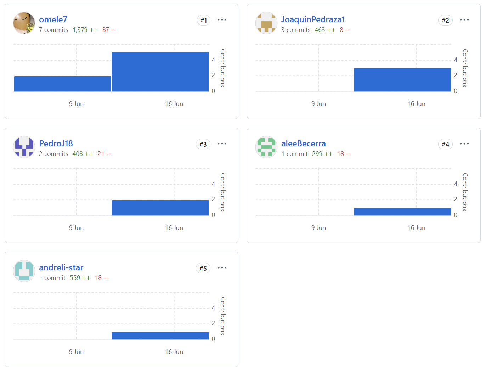
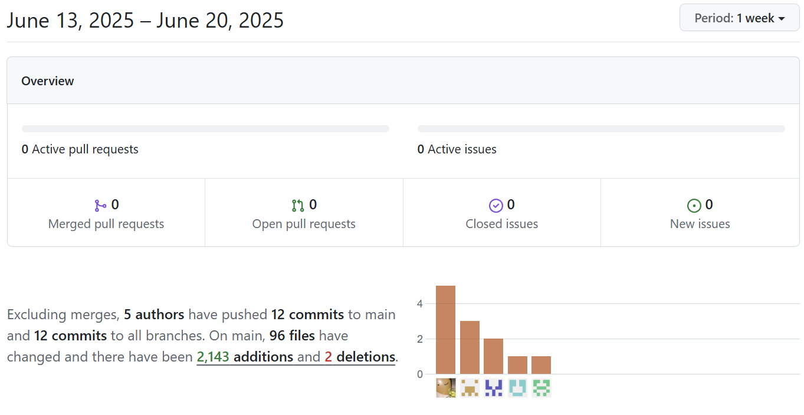

### 5.2.4. Sprint 4
#### 5.2.4.1. Sprint Planning 4
#### 5.2.4.2 Aspect Leaders and Collaborators.
#### 5.2.4.3. Sprint Backlog 4

| **User Story Id** | **User Story Title** | **Work-Item/Task Id** | **Work-Item/Task Title** | **Description** | **Estimation** | **Assigned To** | **Status** |
|:-----------------:|:--------------------:|:---------------------:|:-----------------------:|:---------------:|:--------------:|:--------------:|:----------:|
| US014 | Publicación de eventos musicales | T01 | Publicación de eventos | Registro de eventos en la plataforma | 3h | Diego Cabrera | Done |
| TS001 | Registro de usuario (artista o promotor) a través de un RESTful API | T10 | Registro de usuarios en el web services | Registro de usuarios a través del Web Services | 3h | Pedro Nanfuñay | Done |
| TS002 | Inicio de sesión mediante RESTful API | T01 | Inicio de sesión de usuarios | Validar campos de inicio de sesión para el acceso a la plataforma a través del Web Services | 2h | Pedro Nanfuñay | Done |
| TS003 | Publicar evento desde un RESTful API | T11 | Registro de un evento en el web services | Publicación de eventos a través del Web Services | 3h | Diego Cabrera | Done |
| TS004 | Postulación del artista a un evento vía RESTful API | T02 | Registro de postulación de un artista | Registro de postulación del artista para un evento publicado a través del Web Services | 3h | Joaquín Pedraza | Done |
| TS011 | Visualización de postulaciones del artista vía RESTful API | T12 | Visualización de postulaciones registradas | Visualización de postulaciones registradas por el músico a través del Web Services | 2h | Joaquin Pedraza | Done |
| TS012 | Evaluación post-evento mediante RESTful API | T13 | Registro de evaluación de evento | Registro de evaluación tras la finalización del evento a través del Web Services | 2h | Diego Cabrera | Done |
| TS013 | Carga y edición del perfil artístico vía RESTful API | T14 | Editar información del perfil | Editar información del perfil a través del Web Services | 2h | Pedro Nanfuñay | Done |

#### 5.2.4.4. Development Evidence for Sprint Review 4

Durante el presente sprint, se han realizado avances e implementaciones significativas en el desarrollo de la plataforma, conectando el Frontend y Backend. Se han completado historias relacionadas a los mismos mediante múltiples commits en los repositorios correspondientes. A continuación, se presenta una tabla que incluye los commits relacionados con la implementación para los repositorios del Frontend y Backend.

| **Repository**     | **Branch** | **Commit Id** | **Commit Message** | **Commit Message Body (resumen)** | **Committed on (Date)** |
|--------------------|------------|---------------|---------------------|----------------------------------|--------------------------|
| Front-End | master | 4771447 | feat(front-end): connected the register section with the backend. | Conexión de la sección de registro con el backend | Jul 3, 2025 |
| Back-End | main | 93617d4 | feat: added the IAM service, with JWT authentication. | Se añadió la autenticación mediante JWT | Jul 3, 2025 |
| Back-End | main | f9c839d | feat: unified the IAM and the Profile section. | Se unificaron las secciones IAM y Profile | Jul 3, 2025 |
| Back-End | main | 73b7e18 | feat: updated the ProfileController. | Actualización del Controlador de Profile | Jul 3, 2025 |

#### 5.2.4.5. Execution Evidence for Sprint Review 4
#### 5.2.4.6. Services Documentation Evidence for Sprint Review 4
Hemos logrado desplegar una aplicación web conectada a un backend Spring Boot. A continuación, se muestra la documentación de la API que se consume desde el frontend.
| **Endpoint Name** | **Implemented Actions** | **Call Syntax** | **Parameters Specification** | **Call Example** | **Response Explanation** |
|-------------------|--------------------------|------------------|-------------------------------|------------------|---------------------------|
| **Postulations** | POST | `/api/v1/postulations` | `candidateId`, `eventId`, `motivation` | `POST http://localhost:8080/api/v1/postulations` | Crea una nueva postulación a un evento. |
| **Agendas** | GET, POST, PUT, DELETE | GET: `/api/v1/agendas/{agendaId}` GET: `/api/v1/agendas` POST: `/api/v1/agendas` PUT: `/api/v1/agendas/{agendaId}` DELETE: `/api/v1/agendas/{agendaId}` | GET/PUT/DELETE: `agendaId` POST: `title`, `description`, `date`, `location` | `GET http://localhost:8080/api/v1/agendas/1` | Permite gestionar agendas de eventos por ID o listarlas todas. |
| **Profiles** | GET, POST, PUT | GET: `/api/v1/profiles/{id}` GET: `/api/v1/profiles` POST: `/api/v1/profiles` PUT: `/api/v1/profiles/{id}` | GET/PUT: `id` POST: `name`, `email`, `bio`, `interests` | `GET http://localhost:8080/api/v1/profiles/1` | Devuelve información del perfil correspondiente o permite su actualización. |
| **Evaluations** | GET, POST, PUT, DELETE | GET: `/api/v1/evaluations/{id}` GET: `/api/v1/evaluations` POST: `/api/v1/evaluations` PUT: `/api/v1/evaluations/{id}` DELETE: `/api/v1/evaluations/{id}` | GET/PUT/DELETE: `id` POST: `evaluatorId`, `candidateId`, `score`, `feedback` | `GET http://localhost:8080/api/v1/evaluations/3` | Devuelve o modifica una evaluación específica por ID. |
| **Events** | GET, POST, GET by genre | GET: `/api/v1/events` POST: `/api/v1/events` GET: `/api/v1/events/genre/{genre}` | POST: `title`, `description`, `date`, `genre` GET by genre: `genre` | `GET http://localhost:8080/api/v1/events/genre/rock` | Devuelve todos los eventos, permite crear nuevos o filtrar por género. |

#### 5.2.4.7. Software Deployment Evidence for Sprint Review 4
#### 5.2.4.8. Team Collaboration Insights during Sprint 4

Durante este sprint, el equipo logró finalizar los tres componentes fundamentales de la plataforma TocaAqui, consolidando el producto en su versión funcional para ser presentado. Los entregables completados fueron siendo estos la landing page, web application y web service.

**Frontend**  
Dentro del frontend  se han realizado pequeñas mejoras y se han añadido funcionalidades extra, en base a los cambios relacionados con la adaptación de las entidades al backend.
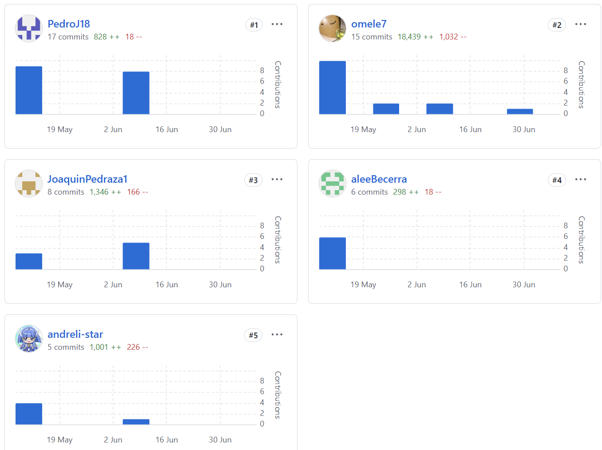

**Backend**  
Dentro del backend se han agregado nuevos endpoints para autenticación de usuarios además de la corrección de endpoints que funcionaban de manera incorrecta y por tanto complicaban el progreso.
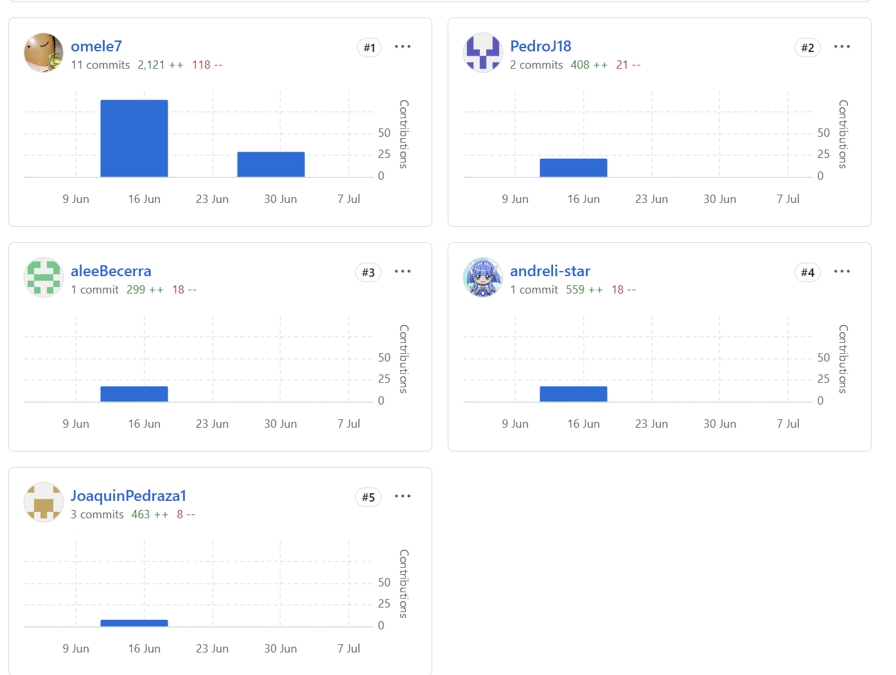

### 5.3 Validation Interviews
#### 5.3.1 Diseño de entrevistas

**Objetivo de la entrevista:**

Validar la usabilidad y efectividad de la landing page de TocaAquí y de los flujos de usuario (user flows) asegurando que cada flujo sea intuitivo, claro y funcional para los usuarios y su interaccion con la plataforma.

**Segmento: Músicos Independientes**

**Objetivo:Evaluar si el diseño, el flujo de registro, las herramientas de gestión musical y la claridad en la propuesta de valor ayudan al músico a comprender y usar la plataforma eficientemente..**
-*Explicación de los alcances de la demostración*
- Landing Page
- Plataforma del Fronted (Producto)
- *Principales tareas en la aplicación*

-*Navegacion a través de la plataforma web*
-*Flujos de usuario (user flows):*
1. El usuario ingresa a landing page 
2. Registro y creación de perfil musical.
3. Visualización de fechas disponibles y postulación a eventos.
4. Firma de contratos digitales y gestión de pagos mediante escrow.
5. Gestión logística del evento desde su cuenta.
6. Revisión de evaluaciones post-evento.
7. Componentes visuales para presentación de artistas y eventos.
8. Botones y secciones para registro/login.
9. Estilos y maquetado de varias páginas tipo portafolio o perfil.  

-*Formato de Registro de la Entrevista*
*Datos del Entrevistado:
- Nombre y apellidos
- Edad
- Ciudad de residencia
- Dispositivo utilizado (laptop)

-*Preguntas principales:*  
- ¿Qué te pareció la apariencia general de la landing page de TocaAquí? ¿Te transmitió confianza y profesionalismo como músico independiente?

- ¿Captaste rápidamente la propuesta de valor de TocaAquí? ¿Te quedó claro desde el inicio cómo puede ayudarte a conseguir más presentaciones?

- ¿La plataforma te permite visualizar fácilmente fechas disponibles para tocar? ¿Sientes que podrías gestionar tus shows sin complicaciones?

- ¿La sección 'Sobre Nosotros' y el equipo de desarrollo te generaron confianza para unirte a la comunidad?

- ¿Qué opinas de los planes que se ofrecen? ¿Notas diferencias claras entre el Básico, Medio y Premium?

- ¿Te gustaría ver ejemplos reales de bandas o solistas que ya usaron TocaAquí para cerrar presentaciones?

- ¿Te sentiste motivado a registrarte en la plataforma después de leer la landing page? ¿Qué te animaría aún más a hacerlo?
  
- ¿Qué te parece la página de inicio? ¿Se entiende de qué trata la plataforma?

- ¿Qué info te gustaría ver en el perfil de un músico o promotor?

- ¿Qué te haría sentir seguro a al usar esta plataforma? Crees q es importante la proteccion de datos?

- ¿Qué detalles esperas ver al entrar a un evento o perfil?

- ¿Cómo te gustaría contactar o contratar a un músico desde la plataforma?

**Segmento: Promotores**

**Objetivo: Determinar si los promotores encuentran la plataforma útil y eficiente para publicar eventos, recibir postulaciones, gestionar aspectos técnicos y tomar decisiones informadas sobre artistas..**

-*Explicación de los alcances de la demostración*
- Landing Page
- Plataforma del Fronted (Producto)
-  Principales tareas en la aplicación

-*Navegacion a través de la plataforma web*
-*Flujos de usuario (user flows):*
1. El usuario ingresa a landing page 
2. Registro y configuración de perfil como promotor.
3. Publicación de fechas disponibles para eventos.
4. Revisión y selección de postulaciones de artistas.
5.Validación de requerimientos técnicos de los artistas.
6. Evaluación de artistas post-evento.
7. Componentes visuales para presentación de artistas y eventos.
8. Botones y secciones para registro/login.
9. Estilos y maquetado de varias páginas tipo portafolio o perfil.  
-*Formato de Registro de la Entrevista*
-*Datos del Entrevistado:*

- Nombre y apellidos
- Edad
- Ciudad de residencia
- Dispositivo utilizado (smartphone, tablet, laptop)

-*Preguntas principales:*  
- ¿La Landing Page de TocaAquí transmite confianza para que un promotor como tú publique sus eventos? ¿Qué mejorarías?

- ¿La navegación de la plataforma te pareció intuitiva para iniciar la publicación de un nuevo evento?

- ¿El flujo de publicación de eventos incluye toda la información que tú necesitas detallar (rider técnico, condiciones, ubicación)?

- ¿Te resultó útil y funcional la parte donde validas los requerimientos técnicos de cada artista?

- ¿Qué opinas del sistema de contratos digitales y pagos protegidos? ¿Te genera confianza para cerrar acuerdos?

- ¿La interfaz te permite visualizar bien el estado de tus eventos y las gestiones logísticas en curso?

- ¿Qué aspecto de la plataforma crees que podría hacerle mejoras para los próximos eventos?

- ¿Qué te parece la página de inicio? ¿Se entiende de qué trata la plataforma?

- ¿Qué info te gustaría ver en el perfil de un músico o promotor?

- ¿Qué te haría sentir seguro a al usar esta plataforma? Crees q es importante la proteccion de datos?

- ¿Qué detalles esperas ver al entrar a un evento o perfil?

- ¿Cómo te gustaría contactar o contratar a un músico desde la plataforma?

### 5.3.2. Registro de Entrevistas.
  
A continuación presentamos los resultados de las entrevistas de validación realizadas a los musicos independientes y promotores, nuestros segmentos objetivos.

### Segmento : Músicos Independientes
**Entrevista 1**    
<table border="1" cellspacing="0" cellpadding="8">
  <thead>
    <tr>
      <th><strong>Dato</strong></th>
      <th><strong>Información</strong></th>
    </tr>
  </thead>
  <tbody>
    <tr><td>Nombre completo</td><td>Alexander Gabriel Montoya Torres</td></tr>
    <tr><td>Edad</td><td>19 años</td></tr>
    <tr><td>Distrito</td><td>San Miguel</td></tr>
    <tr><td>Inicio de la entrevista</td><td>00:00</td></tr>
    <tr><td>Duración de la entrevista</td><td>06:40</td></tr>
    <tr><td>Foto captura</td><td>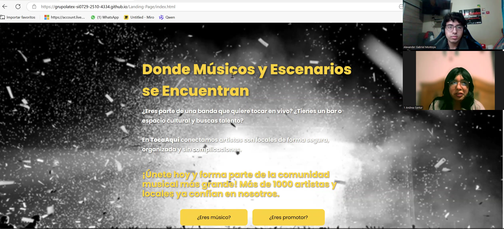</td></tr>
    <tr><td>Visualización de la Landing Page y el dashboard </td><td>Le gustó mucho el diseño general, resaltando los colores negro, amarillo y blanco. Considera que transmite confianza y profesionalismo. La información está organizada de forma clara y entendible.</td></tr>
    <tr><td>Exploración de funcionalidades clave</td><td>Considera práctico el calendario de fechas para organizar presentaciones y valora la facilidad de comunicación con promotores. Sugiere mostrar ejemplos de bandas que ya usaron la plataforma.</td></tr>
    <tr><td>Flujos de registro y navegación del producto </td><td>Positiva. Se siente motivado a registrarse. Sugiere mejorar el perfil de usuario agregando más detalles para hacerlo más completo.</td></tr>
    <tr><td>Publicación de eventos y postulación</td><td>Valoró la funcionalidad de la agenda de shows y la posibilidad de gestionar fechas y logística de forma sencilla.</td></tr>
    <tr><td>Planes y diferencias de servicios</td><td>Entiende las diferencias entre los planes, pero sugiere que funcionalidades como escrow automático y automatización logística también estén en el plan medio.</td></tr>
  </tbody>
</table>
[URL de la entrevista](https://upcedupe-my.sharepoint.com/:v:/g/personal/u20211b293_upc_edu_pe/EZu23DrF5TRFv6Gu3dIsxxABlZx2e3B57LDb-pMRu7oXKQ?nav=eyJyZWZlcnJhbEluZm8iOnsicmVmZXJyYWxBcHAiOiJPbmVEcml2ZUZvckJ1c2luZXNzIiwicmVmZXJyYWxBcHBQbGF0Zm9ybSI6IldlYiIsInJlZmVycmFsTW9kZSI6InZpZXciLCJyZWZlcnJhbFZpZXciOiJNeUZpbGVzTGlua0NvcHkifX0&e=cCVdHw)

**Entrevista 2**
<table border="1" cellspacing="0" cellpadding="8">
  <thead>
    <tr>
      <th><strong>Dato</strong></th>
      <th><strong>Información</strong></th>
    </tr>
  </thead>
  <tbody>
    <tr><td>Nombre completo</td><td>Bryan Dennis Huamán Salas</td></tr>
    <tr><td>Edad</td><td>20 años</td></tr>
    <tr><td>Distrito</td><td>Surco</td></tr>
    <tr><td>Inicio de la entrevista</td><td>06:40</td></tr>
    <tr><td>Duración de la entrevista</td><td>06:00</td></tr>
    <tr><td>Foto captura</td><td>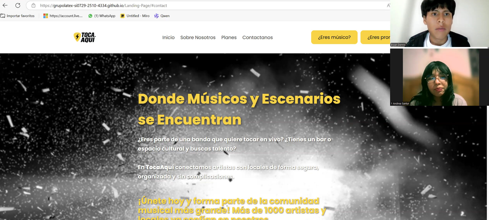</td></tr>
    <tr><td>Visualización de la Landing Page y el dashboard</td><td>La apariencia le transmitió confianza y profesionalismo, pero comentó que el fondo dificultaba la lectura por el exceso de brillo. Sugiere ajustar el color o contraste.</td></tr>
    <tr><td>Exploración de funcionalidades clave</td><td>Percibe que la plataforma ofrece opciones interesantes como contacto con locales y fechas disponibles, aunque desea ver más herramientas visuales asociadas a la música.</td></tr>
    <tr><td>Flujos de registro y navegación del producto</td><td>Entendió bien los accesos iniciales y considera que podría gestionar sus shows sin mayores complicaciones.</td></tr>
    <tr><td>Publicación de eventos y postulación</td><td>Aprecia que haya formas claras de contacto y postulación, aunque no profundizó mucho en esta parte inicial.</td></tr>
    <tr><td>Planes y diferencias de servicios</td><td>Entiende las diferencias entre Básico, Medio y Premium, pero sugiere agregar más beneficios para hacerlo más atractivo.</td></tr>
  </tbody>
</table>
[URL de la entrevista](https://upcedupe-my.sharepoint.com/:v:/g/personal/u20211b293_upc_edu_pe/EZu23DrF5TRFv6Gu3dIsxxABlZx2e3B57LDb-pMRu7oXKQ?nav=eyJyZWZlcnJhbEluZm8iOnsicmVmZXJyYWxBcHAiOiJPbmVEcml2ZUZvckJ1c2luZXNzIiwicmVmZXJyYWxBcHBQbGF0Zm9ybSI6IldlYiIsInJlZmVycmFsTW9kZSI6InZpZXciLCJyZWZlcnJhbFZpZXciOiJNeUZpbGVzTGlua0NvcHkifX0&e=cCVdHw)

**Entrevista 3**
<table border="1" cellspacing="0" cellpadding="8">
  <thead>
    <tr>
      <th><strong>Dato</strong></th>
      <th><strong>Información</strong></th>
    </tr>
  </thead>
  <tbody>
    <tr><td>Nombre completo</td><td>Benjamín Peraltilla Herrera </td></tr>
    <tr><td>Edad</td><td>18 años</td></tr>
    <tr><td>Distrito</td><td>Breña</td></tr>
    <tr><td>Inicio de la entrevista</td><td>00:00</td></tr>
    <tr><td>Duración de la entrevista</td><td>06:40</td></tr>
    <tr><td>Foto captura</td><td>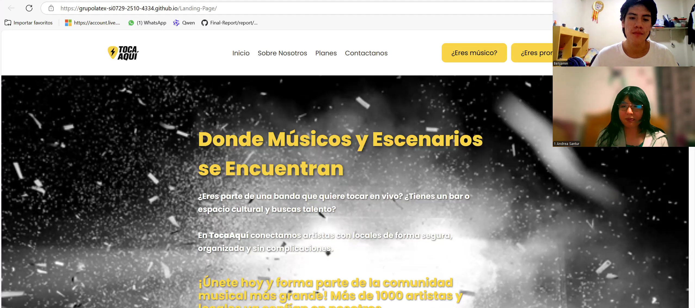</td></tr>
    <tr><td>Visualización de la Landing Page y el dashboard</td><td>La landing page le pareció llamativa, especialmente por el uso de colores, y le transmitió confianza y profesionalismo.</td></tr>
    <tr><td>Exploración de funcionalidades clave</td><td>Entendió rápidamente la propuesta de valor: músicos se presentan y promotores los descubren de manera clara y directa.</td></tr>
    <tr><td>Flujos de registro y navegación del producto</td><td>Se mostró motivado a registrarse tras explorar la landing page. Consideró que la sección "Sobre nosotros" y ver los desarrolladores aumentó su confianza. Sugiere mostrar ejemplos de usuarios anteriores para reforzar la confianza.</td></tr>
    <tr><td>Publicación de eventos y postulación</td><td>No observó claramente cómo gestionar fechas disponibles, pero entendió que la plataforma facilita encontrar oportunidades para tocar.</td></tr>
    <tr><td>Planes y diferencias de servicios</td><td>Valoró positivamente los diferentes planes (básico, medio y premium) y consideró que los precios son adecuados en comparación al mercado.</td></tr>
  </tbody>
</table>
[URL de la entrevista](https://upcedupe-my.sharepoint.com/:v:/g/personal/u20211b293_upc_edu_pe/EZu23DrF5TRFv6Gu3dIsxxABlZx2e3B57LDb-pMRu7oXKQ?nav=eyJyZWZlcnJhbEluZm8iOnsicmVmZXJyYWxBcHAiOiJPbmVEcml2ZUZvckJ1c2luZXNzIiwicmVmZXJyYWxBcHBQbGF0Zm9ybSI6IldlYiIsInJlZmVycmFsTW9kZSI6InZpZXciLCJyZWZlcnJhbFZpZXciOiJNeUZpbGVzTGlua0NvcHkifX0&e=cCVdHw)

### Segmento : Promotores

**Entrevista 1** 

<table border="1" cellspacing="0" cellpadding="8">
  <thead>
    <tr>
      <th><strong>Dato</strong></th>
      <th><strong>Información</strong></th>
    </tr>
  </thead>
  <tbody>
    <tr><td>Nombre completo</td><td>William Agustín Ventura Saldaña</td></tr>
    <tr><td>Edad</td><td>27 años</td></tr>
    <tr><td>Distrito</td><td>Surco</td></tr>
    <tr><td>Inicio de la entrevista</td><td>00:00</td></tr>
    <tr><td>Duración de la entrevista</td><td>06:40</td></tr>
    <tr><td>Foto captura</td><td>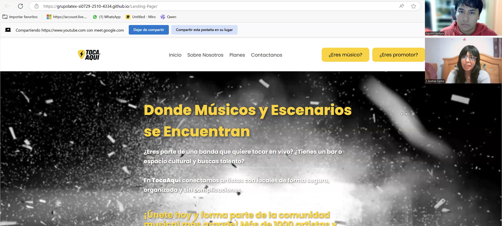</td></tr>
    <tr><td>Visualización de la Landing Page y el dashboard</td><td>Indicó que la landing page es llamativa y vistosa, transmitiendo confianza especialmente para eventos grandes. Sin embargo, comentó que para personas que buscan algo más discreto podría no ser tan atractiva.</td></tr>
    <tr><td>Exploración de funcionalidades clave</td><td>Comentó que el sistema de validación de requerimientos técnicos de cada artista es útil y genera confianza. También mencionó que el sistema de contratos digitales y pagos protegidos refuerza esta sensación.</td></tr>
    <tr><td>Flujos de registro y navegación del producto</td><td>Opinó que la navegación para iniciar la publicación de un evento es bastante intuitiva y fácil de comprender.</td></tr>
    <tr><td>Publicación de eventos y postulación</td><td>Indicó que la plataforma incluye la mayoría de la información necesaria, como planes y datos de contacto, lo que genera confianza para la gestión de eventos.</td></tr>
    <tr><td>Planes y diferencias de servicios</td><td>Se mostró conforme con las diferencias entre los planes y necesidades, que proporciona."</td></tr>
  </tbody>
</table>
[URL de la entrevista](https://upcedupe-my.sharepoint.com/:v:/g/personal/u20211b293_upc_edu_pe/EZu23DrF5TRFv6Gu3dIsxxABlZx2e3B57LDb-pMRu7oXKQ?nav=eyJyZWZlcnJhbEluZm8iOnsicmVmZXJyYWxBcHAiOiJPbmVEcml2ZUZvckJ1c2luZXNzIiwicmVmZXJyYWxBcHBQbGF0Zm9ybSI6IldlYiIsInJlZmVycmFsTW9kZSI6InZpZXciLCJyZWZlcnJhbFZpZXciOiJNeUZpbGVzTGlua0NvcHkifX0&e=cCVdHw)

**Entrevista 2**
<table border="1" cellspacing="0" cellpadding="8">
  <thead>
    <tr>
      <th><strong>Dato</strong></th>
      <th><strong>Información</strong></th>
    </tr>
  </thead>
  <tbody>
    <tr><td>Nombre completo</td><td>David Manuel Torres Meneses</td></tr>
    <tr><td>Edad</td><td>20 años</td></tr>
    <tr><td>Distrito</td><td>Los Olivos</td></tr>
    <tr><td>Inicio de la entrevista</td><td>00:00</td></tr>
    <tr><td>Duración de la entrevista</td><td>06:40</td></tr>
    <tr><td>Foto captura</td><td>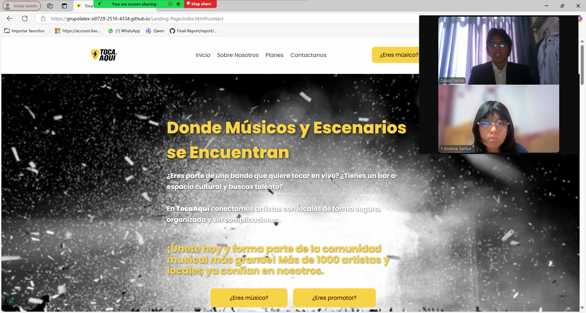</td></tr>
    <tr><td>Visualización de la Landing Page y el dashboard</td><td>Genera alta confianza. La landing page es vista como una herramienta de apoyo fundamental para los promotores. Transmite seriedad y permite sentirse respaldado al momento de agendar o publicar eventos rápidamente.</td></tr>
    <tr><td>Exploración de funcionalidades clave</td><td>Se percibe como didáctica, intuitiva y muy llamativa. Las funcionalidades como la publicación de eventos, la selección en calendario, y el detalle de beneficios son claros y accesibles, facilitando el trabajo del promotor.</td></tr>
    <tr><td>Flujos de registro y navegación del producto</td><td>Flujo intuitivo y funcional. La navegación inicial permite empezar de forma rápida la programación de eventos, seleccionar fechas, lugares y condiciones fácilmente. Además, la validación de requerimientos técnicos por artista mejora la experiencia.</td></tr>
    <tr><td>Publicación de eventos y postulación</td><td>Completo y práctico. Se incluyen todos los requisitos necesarios para publicar eventos: rider técnico, condiciones, ubicación, validaciones de logística y características específicas de cada artista. Se destaca la facilidad para planificar y administrar eventos múltiples.</td></tr>
    <tr><td>Planes y diferencias de servicios</td><td>Aunque actualmente la plataforma es satisfactoria, el entrevistado sugiere mejorar ofreciendo beneficios tipo "Premium" y alianzas estratégicas, que otorguen ventajas tanto a nivel nacional como internacional para promotores frecuentes.</td></tr>
  </tbody>
</table>
[URL de la entrevista](https://upcedupe-my.sharepoint.com/:v:/g/personal/u20211b293_upc_edu_pe/EZu23DrF5TRFv6Gu3dIsxxABlZx2e3B57LDb-pMRu7oXKQ?nav=eyJyZWZlcnJhbEluZm8iOnsicmVmZXJyYWxBcHAiOiJPbmVEcml2ZUZvckJ1c2luZXNzIiwicmVmZXJyYWxBcHBQbGF0Zm9ybSI6IldlYiIsInJlZmVycmFsTW9kZSI6InZpZXciLCJyZWZlcnJhbFZpZXciOiJNeUZpbGVzTGlua0NvcHkifX0&e=cCVdHw)

**Entrevista 3**
<table border="1" cellspacing="0" cellpadding="8">
  <thead>
    <tr>
      <th><strong>Dato</strong></th>
      <th><strong>Información</strong></th>
    </tr>
  </thead>
  <tbody>
    <tr><td>Nombre completo</td><td>Ela Moreno</td></tr>
    <tr><td>Edad</td><td>25 años</td></tr>
    <tr><td>Distrito</td><td>Molino</td></tr>
    <tr><td>Inicio de la entrevista</td><td>06:40</td></tr>
    <tr><td>Duración de la entrevista</td><td>06:00</td></tr>
    <tr><td>Foto captura</td><td>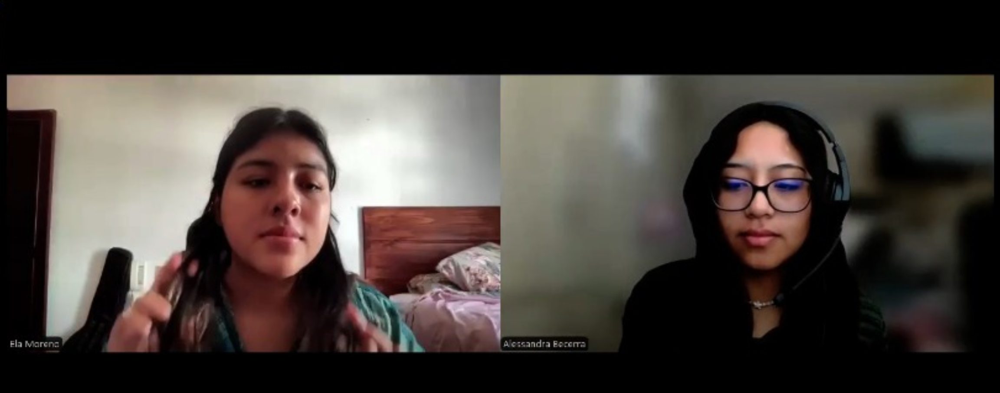</td></tr>
    <tr><td>Visualización de la Landing Page y el dashboard</td><td>Le transmitió confianza y profesionalismo. Destacó que el diseño es atractivo, fácil de manejar y que la idea de la plataforma le pareció innovadora.</td></tr>
    <tr><td>Exploración de funcionalidades clave</td><td>Consideró muy útiles las herramientas como el calendario, contratos digitales, validación técnica y gestor de logística. Mencionó que ayudan a ahorrar mucho tiempo.</td></tr>
    <tr><td>Flujos de registro y navegación del producto</td><td>Opinó que la navegación y el flujo son intuitivos y fáciles de entender. No presentó dificultades al comprender cómo registrarse o postular a eventos.</td></tr>
    <tr><td>Publicación de eventos y postulación</td><td>Consideró que el flujo de publicación contiene toda la información necesaria para gestionar un evento y que el sistema facilita la comunicación entre músicos y promotores.</td></tr>
    <tr><td>Planes y diferencias de servicios</td><td>Mencionó que los planes le parecieron buenos y claros. Notó las diferencias y valoró positivamente la existencia de diferentes opciones para distintos tipos de usuarios.</td></tr>
    <tr><td>Sugerencias de mejora</td><td>Sugirió que podría detallarse más información sobre los organizadores de los eventos para generar aún más confianza en los postulantes.</td></tr>
  </tbody>
</table>
[URL de la entrevista](https://upcedupe-my.sharepoint.com/:v:/g/personal/u20211b293_upc_edu_pe/EZu23DrF5TRFv6Gu3dIsxxABlZx2e3B57LDb-pMRu7oXKQ?nav=eyJyZWZlcnJhbEluZm8iOnsicmVmZXJyYWxBcHAiOiJPbmVEcml2ZUZvckJ1c2luZXNzIiwicmVmZXJyYWxBcHBQbGF0Zm9ybSI6IldlYiIsInJlZmVycmFsTW9kZSI6InZpZXciLCJyZWZlcnJhbFZpZXciOiJNeUZpbGVzTGlua0NvcHkifX0&e=cCVdHw)

  ### 5.3.3. Evaluaciones según herurísticas.

**UX Heuristics & Principles Evaluation**
**Usability – Inclusive Design – Information Architecture**

**CARRERA**: Ingeniería de Software  
**CURSO**: Desarrollo de Aplicaciones Open Source  
**SECCIÓN**: [4334]  
**PROFESORES**: Todos  
**AUDITOR**: Grupo TocaAquí  
**CLIENTE(S)**: Todos

**SITE o APP A EVALUAR**: TocaAquí 

**TAREAS A EVALUAR**

1. Visualización de beneficios y funcionalidades de la plataforma
2. Acceso a la sección de contacto
3. Navegación desde el menú
4. Acceso a los botones de registro por tipo de usuario
5. Cambio de idioma
6. Visualización de testimonios u opiniones

**EVALUACIÓN SEGÚN HEURÍSTICAS**

| # | Heurística | Observación | Severidad (0-4) | Recomendación |
|---|------------|-------------|----------------|---------------|
| 1 | Visibilidad del estado del sistema | No hay indicador visual que confirme que se ha accedido a una sección distinta (por ejemplo, About o Contacto). | 2 | Añadir efectos de scroll o resaltado del menú activo. |
| 2 | Correspondencia entre el sistema y el mundo real | El lenguaje utilizado en botones es claro y amigable ("Únete como artista/promotor"). | 0 | Ninguna. Excelente elección de lenguaje. |
| 3 | Control y libertad del usuario | No hay opción para retroceder fácilmente a la parte superior desde secciones inferiores. | 1 | Añadir un botón “Volver arriba” o scroll automático al hacer clic en el logo. |
| 4 | Consistencia y estándares | Buen uso de íconos y colores consistentes en toda la página. | 0 | Ninguna. |
| 5 | Reconocimiento antes que recuerdo | Secciones como “Equipo” y “Beneficios” están claramente rotuladas. | 0 | Ninguna. |
| 6 | Flexibilidad y eficiencia de uso | El sitio está adaptado a dispositivos móviles (responsive). | 1 | Optimizar el menú para que sea tipo "hamburguesa" en móvil. |
| 7 | Diseño estético y minimalista | El diseño es limpio y moderno, no sobrecarga al usuario. | 0 | Ninguna. |
| 8 | Ayuda y documentación | No hay sección de ayuda visible o guía para nuevos usuarios. | 2 | Incluir una sección tipo “¿Cómo funciona?” con pasos o video explicativo. |

**Evaluación adicional: Inclusive Design**

| Aspecto | Observación | Recomendación |
|---------|-------------|---------------|
| Contraste de colores | El contraste entre texto blanco y fondo es legible, pero el fondo de algunos botones puede mejorar. | Asegurar un contraste mínimo de 4.5:1 en todos los elementos. |
| Tamaño de fuente | Tamaño adecuado en la mayoría de elementos, pero puede ser pequeño en móvil. | Aumentar ligeramente el tamaño en dispositivos pequeños. |
| Inclusión de íconos con texto | Los botones y secciones se entienden sin necesidad de íconos. | Considerar incluir íconos para facilitar el reconocimiento visual. |

# Conclusiones

- TocaAquí responde a una necesidad real en la industria musical independiente, es decir, el proyecto surge como solución a los problemas de informalidad, falta de oportunidades y desorganización que afectan a músicos emergentes y promotores de eventos. Esta plataforma propone profesionalizar el vínculo entre artistas y espacios culturales mediante tecnología segura, accesible y eficiente.

- A través de entrevistas y análisis de segmentos objetivos, se identificó que tanto músicos como promotores demandan herramientas que faciliten la contratación directa, la coordinación logística y el aseguramiento de pagos, confirmando la pertinencia de la solución planteada.

- Aplicando el proceso de Lean UX se establecieron hipótesis, problemas y soluciones que priorizan una experiencia sencilla, intuitiva y confiable. Esto garantiza que la plataforma no solo resuelva problemas técnicos, sino también genere valor emocional y profesional a sus usuarios.

- A diferencia de plataformas existentes que solo ofrecen contactos o promoción de eventos, TocaAquí integra contratación formal, pagos vía escrow, validación técnica y promoción colaborativa, construyendo un ecosistema confiable para el desarrollo de la escena musical emergente.

- La implementación exitosa de TocaAquí no solo beneficiará a músicos y promotores, sino que también contribuirá a dinamizar el circuito cultural independiente, impulsando la profesionalizació

# Bibliografía

- Asociación Peruana de Managers Musicales. (2020). Encuesta sobre el impacto de la pandemia en músicos independientes. Cocktail. https://cocktail.pe/mas-del-80-de-musicos-independientes-padecen-economicamente-durante-la-pandemia/
- Ramos Espinoza, M. A. (2021). Música independiente en Lima: mapeo de un circuito cultural desde las lógicas de sus agentes (Tesis de licenciatura, Pontificia Universidad Católica del Perú). PUCP. https://tesis.pucp.edu.pe/items/ab79feff-9493-4f8e-9aa8-81d3e50ec57d/full
- Soriano, P. D. (2020). Eventos musicales para contribuir a la oferta cultural en el Centro Histórico de Lima. Universidad de San Martín de Porres. https://repositorio.usmp.edu.pe/bitstream/handle/20.500.12727/7073/SORIANO_PD.pdf?sequence=1
